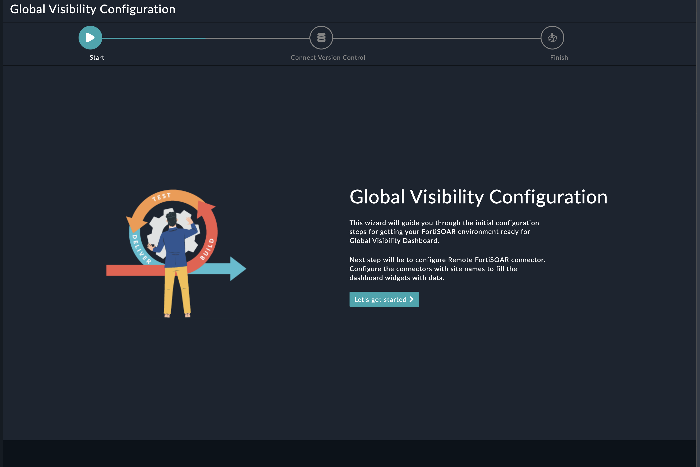
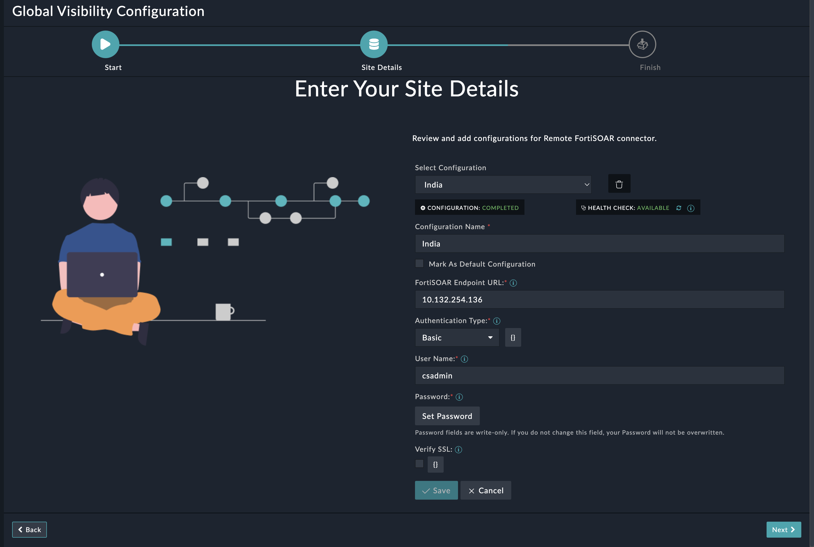
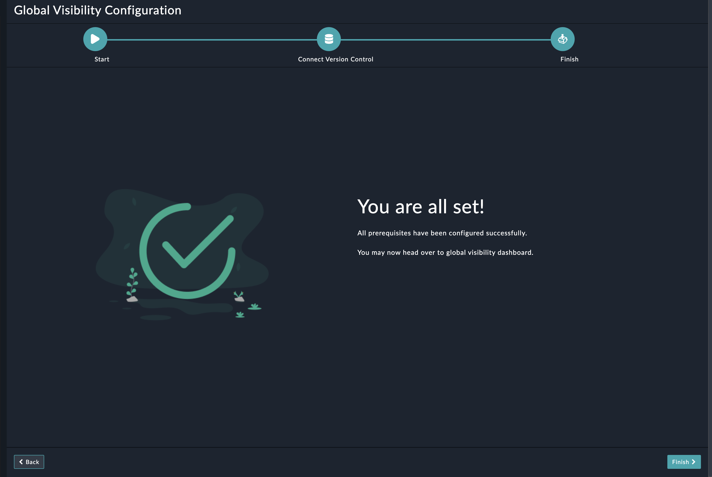

| [Home](../README.md) |
|----------------------|
# Installation

1. To install a widget, click **Content Hub** > **Discover**.

2. From the list of solution pack that appears, search for and select **Continuous Delivery**. 

3. Click the card of the **Continuous Delivery** solution pack card.

4. Click **Configure** on the bottom to begin configuration.

# Configuration

## Global Visibility Configuration Wizard Widget Settings

The configuration settings of the Global Visibility Configuration widget include the following steps to setup Global Visibility configuration:

- Click the **Configure** button to bring up the following wizard screen

    

- Click **Let's Get Started** to proceed

- On the **Connect Version Control** page, configure your Remote Fortisoar environment.

- Click **Next** on lower-right corner

    

- Click **Finish** to complete the configuration.

    

Navigate to the **Continuous Delivery** in the navigation menu to start using the solution pack
| [Installation](./setup.md#installation) | [Configuration](./setup.md#configuration) |
|-----------------------------------------|-------------------------------------------|