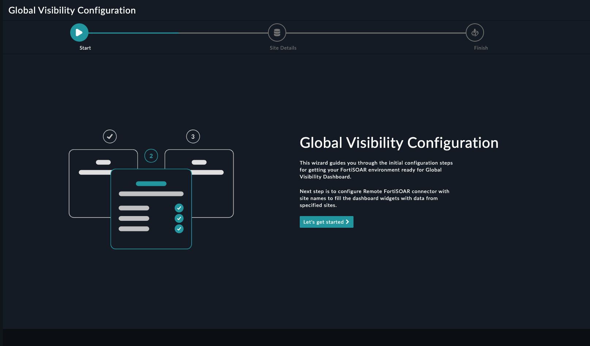

| [Home](../README.md) |
|----------------------|

# Usage

## Global Visibility Configuration Wizard

The configuration settings of the Global Visibility Configuration widget include the following steps to setup Global Visibility configuration:

1. Click the **Configure** button to bring up the following wizard screen:

    

2. Click **Let's Get Started** to proceed

3. On the **Site Details** page, enter the required details to configure your remote FortiSOAR environment.

- Click **Next** on lower-right corner

    

- Click **Finish** to complete the configuration.

    

| [Installation](./setup.md#installation) | [Configuration](./setup.md#configuration) |
|-----------------------------------------|-------------------------------------------|